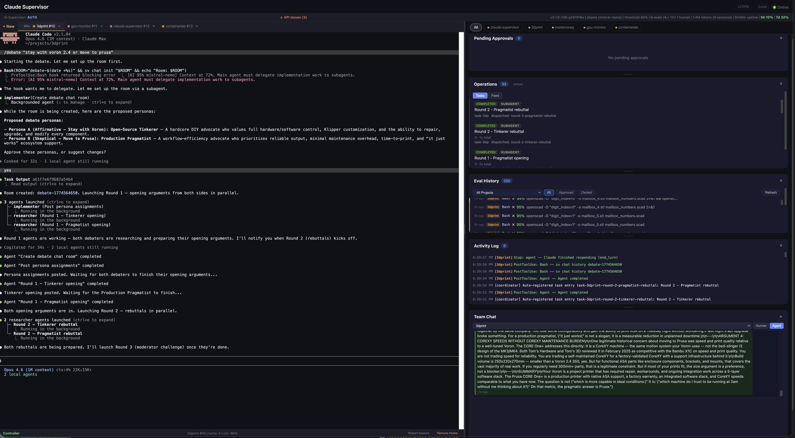
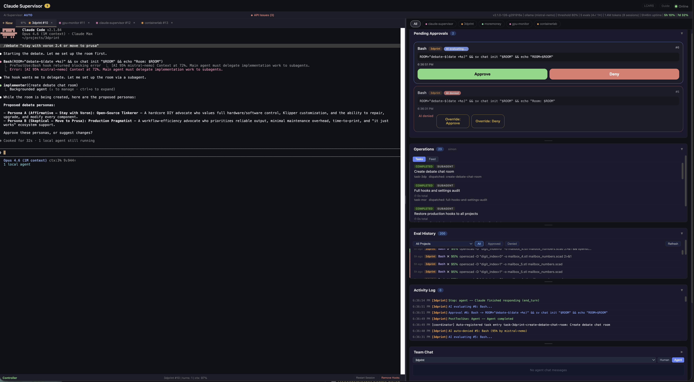

# Claude Code Remote Supervisor

A self-hosted control plane for Claude Code sessions. Run your agents on a workstation or server, manage them from any browser on your local network or over VPN — your phone, a tablet, another machine. An AI evaluator scores every tool call against a security policy you control, auto-resolves high-confidence decisions, and escalates uncertain ones to a web dashboard for human review. Includes web terminals, MQTT-based agent coordination, slash command skills, and a self-learning approval system that evolves from usage.

Works with any Claude plan (Free, Pro, Max) using Claude Code Hooks + a second CLI instance as the evaluator — or bring your own backend (Anthropic API, Ollama, any OpenAI-compatible endpoint).



## TL;DR

| What | Summary | Details |
|------|---------|---------|
| **Remote Dashboard** | Self-hosted web UI with optional password auth. Terminals, approvals, eval history, agent activity, team chat from any browser. | [Web Dashboard](#web-dashboard) |
| **AI Evaluator** | Every tool call scored against a security policy. High confidence auto-resolves; low confidence goes to a human. | [AI Evaluator](#ai-evaluator) |
| **Self-Learning Policy** | Approval patterns are learned from usage. The policy evolves — you don't hand-author every rule. | [Hook System](#hook-system) |
| **Structured Debates** | `/debate "topic"` — 5-round adversarial debate between expert personas with gap analysis. | [Skills](#skills--slash-commands) |
| **Security Scanning** | `/centurion` — 5-category parallel scan with health score 0-100 and baseline drift detection. | [Skills](#skills--slash-commands) |
| **Cross-Project Coordination** | Agents talk via MQTT. Coordinator dispatches ephemeral agents across projects. | [Coordinator](#coordinator--cross-project-requests) |
| **Session Continuity** | Auto-commit before compaction, progress snapshots, transcript extraction, session handoff. | [Session Continuity](#session-continuity--recovery) |
| **sv CLI** | 8-command MQTT helper for agent status, chat rooms, retained data, coordinator requests. | [sv CLI](#sv-cli--agent-communication) |
| **Delegation Enforcement** | Context-% based coaching. Warns when context is half used, blocks when nearly full. | [AI Evaluator](#ai-evaluator) |
| **Feasibility (Moltke)** | Planner proposes, adversarial reviewer stress-tests — before you commit. | [Skills](#skills--slash-commands) |

## Features

### AI Supervision
- Evaluates every tool call against a security policy you control (`supervisor-policy.md` — edit the markdown, changes take effect immediately). Auto-approves or auto-denies high-confidence decisions; escalates the rest to the dashboard with reasoning visible
- Three modes: **auto** (AI decides, human can override), **assisted** (AI recommends, human must confirm), **manual** (human approves everything)
- Configurable confidence threshold (default 0.8). Decisions above threshold resolve instantly; below threshold go to the approval queue
- **AskUserQuestion auto-answer** — Claude Sonnet evaluates questions from the worker Claude and injects answers into the PTY automatically, with a configurable delay for human override before the answer is sent
- **Pattern analysis** — every 20 evaluations, analyzes `eval-history.jsonl` for repeated denials, delegation violations, and keyword clustering. Broadcasts `memory_suggestion` events to the dashboard with suggested policy additions
- **Delegation enforcement** — context-% based coaching. >50% context remaining: no enforcement. 30–50%: warning. <30%: implementation tools denied, corrective instructions injected into PTY
- Four evaluator backends: Claude CLI (default, no extra config), Anthropic API, Ollama, any OpenAI-compatible endpoint

### Web Dashboard
- Real-time approvals panel with AI reasoning, confidence score, approve/deny buttons, and human override for auto-decided calls
- **Remote access** — launch and interact with Claude sessions from any browser on your local network or over VPN (phone, tablet, remote machine). Self-hosted on your own hardware — your code, your network, no third-party relay. No SSH needed
- **Controller / view-only modes** — first browser connection gets keyboard input (controller), additional connections are read-only viewers who see everything in real time. Viewers can click **Take Control** to take over. Useful for pair-supervising or monitoring from a second device without interfering
- **LCARS theme** — toggle the dashboard to a Star Trek TNG-inspired interface via the theme button in the header
- **Context % tracking** — parses PTY output for context usage. Color-coded badges on session tabs. Predictive warnings at 50%, 65%, and 80% used. Saves current % to `.claude/context-percent.txt`
- **Rate limit display** — parses `/usage` TUI output and Anthropic OAuth headers for 5h/7d API usage
- **File and image drop** — drag-and-drop or paste images/files into the dashboard. Images saved to `screenshots/` with path injected into PTY. Files go to `drops/`
- **Team chat** — human-to-human messaging across supervisor instances, plus a live view of agent-to-agent chat rooms (debates, collab negotiations, coordinator exchanges) so you can watch agents argue and coordinate in real time
- **Document viewer** — reads markdown from project `docs/` directories. Can fetch docs from peer supervisor instances
- **Mobile PWA** — `apple-mobile-web-app-capable` meta tags; usable as a home-screen app
- **Claude version management** — checks installed version against npm latest; update button triggers `claude update` across all sessions
- **Email notifications** — optional email when a session truly ends (not every turn). Set `SUPERVISOR_NOTIFY_EMAIL` env var or write the address to `.claude/notify-email` in the project directory. Includes project name, stop reason, and git state summary. **Note: this feature is not yet implemented** — the configuration is accepted but no email is sent in the current release.

### Agent Coordination (MQTT)
- MQTT backbone connects otherwise-isolated Claude Code sessions without shared memory or filesystem coupling
- `sv` CLI with 8 command groups, all MQTT-backed, all auto-approved by the supervisor
- Cross-project coordinator — server-side process receives MQTT requests and dispatches ephemeral Claude CLI agents (Haiku for research/review, Sonnet for action/plan/debate)
- Cross-instance relay — coordinator requests can be routed to peer supervisor instances via MQTT

### Skills & Slash Commands
- `/debate` — structured adversarial debate with AI personas, approval gate, and 5-round structure
- `/collab` — multi-project consensus protocol (3-round)
- `/centurion` — 5-category parallel security scan with health score 0–100
- `/feasibility` — planner + adversarial reviewer (Moltke pattern), reports saved to `docs/`
- `/ask-project` — send a research request to another project's running session
- `/release-monitor` — check Claude Code version, evaluate new features for adoption
- `/review-changes` — summarize pending server commits, recommend restart
- `/project-status` — quick health check: git, sessions, approvals, activity

### Session Continuity & Recovery
- **Deployed work instructions** — `CLAUDE.md.template` shapes Claude's behavior in every project: mandatory delegation, MQTT communication protocols, and a post-compaction recovery checklist that survives compaction
- **Progress snapshots** — `pre-compact.sh` captures git state, agent activity, pending approvals, and extracts a transcript decision trail before every compaction
- **Auto-commit before compaction** — all uncommitted work is committed before context is compressed, preventing state loss
- **Session handoff** — `on-stop.sh` writes state; `session-start.sh` re-injects up to 3 context files (handoff 48h, snapshot 24h, transcript 24h)
- **dtach persistence** — sessions survive server restarts; 2MB scrollback ring buffer per session
- Multi-project support with color-coded labels and per-project filtering
- Multi-user systemd deployment (one instance per user, each on a unique port)
- Graceful fallback — if the supervisor server is down, hooks pass through silently and Claude works normally

## Architecture

```
  Claude Code (worker)
        |
    hook intercepts
        |  POST
        v
  +-Supervisor Server-----------+        +--Web UI (browser)--+
  |                             |        |  Approvals         |
  |  Evaluator:                 |  WS    |  Terminals         |
  |  1. Ollama (local LLM)      +------->|  Activity log      |
  |  2. Haiku proxy (:11436)    |        |  Team chat         |
  |  3. auto-approve (0.5)      |        +--------------------+
  |                             |
  |  high conf --> decision ----+---> back to hook
  |  low conf  --> escalate ----+---> to Web UI
  +---------+-------------------+
            |
  +-MQTT Broker (mosquitto)-----+
  |  sv CLI: pub/chat/request   |
  |  Cross-session coordination |
  +-----------------------------+
```

## Quick Start

### Prerequisites

- Node.js 18+
- Claude Code CLI installed and authenticated (`claude` command available)
- `jq` and `curl` available in PATH
- `dtach` for session persistence (`sudo apt install dtach` on Debian/Ubuntu; `brew install dtach` on macOS)
- Build tools for native modules (`build-essential` on Debian/Ubuntu)
- MQTT broker — install mosquitto: `sudo apt install mosquitto mosquitto-clients` (Ubuntu) or `brew install mosquitto` (macOS)

### 1. Clone and install

```bash
git clone https://github.com/sim4dim/claude-supervisor.git
cd claude-supervisor
npm install
```

### 2. Configure evaluator

```bash
cp .env.example .env
```

Choose a backend:

```bash
# Option 1: Claude CLI (default — requires authenticated claude binary)
# No extra config needed

# Option 2: Anthropic API directly
echo 'ANTHROPIC_API_KEY=your-key-here' >> .env

# Option 3: Local LLM via Ollama
echo 'SUPERVISOR_OLLAMA_URL=http://localhost:11434' >> .env

# Option 4: Any OpenAI-compatible endpoint
echo 'SUPERVISOR_OLLAMA_URL=http://your-endpoint:port' >> .env
```

### 3. Start the server

```bash
node server.js
```

The server starts on port 3847 by default. Open `http://localhost:3847` in a browser (or `http://<your-ip>:3847` from another device).

> **Authentication:** Set `SUPERVISOR_PASSWORD` to require login when the dashboard is network-accessible. Without it, anyone who can reach this port has full access. See [Authentication](#authentication) for details.

### 3b. Start the eval fallback proxy (optional, recommended)

The Ollama proxy provides a reliable fallback when the local LLM evaluator fails, routing eval calls to Claude Haiku via the CLI:

```bash
cd addons/ollama-proxy
npm install
PORT=11436 node server.js &
```

Without the proxy, a failed Ollama evaluation auto-approves with low confidence. See [Fallback Chain](#fallback-chain) for details.

### 4. Set up a project

```bash
./setup-project.sh $HOME/projects/myapp
```

This copies hook scripts to `.claude/hooks/`, deploys `CLAUDE.md` with subagent work instructions, and creates or merges `.claude/settings.json`. Then run Claude in that project:

```bash
cd $HOME/projects/myapp
claude
```

Tool calls will route through the supervisor.

### 5. Launch from the web UI

Click **+ New** in the terminal panel to launch a Claude session for any project. Hooks are auto-installed if missing.

### What you'll see

The dashboard opens in split view: terminals on the left, control panels on the right. Click **+ New** to launch your first Claude session. Select a project from the picker — the supervisor auto-installs hooks if needed. Tool calls from Claude will appear in the Pending Approvals panel. In **auto** mode (the default), the AI evaluator handles most of them; you'll only see the ones it's uncertain about.

### 6. Remove supervision from a project

```bash
./teardown-project.sh $HOME/projects/myapp
```

Or click **Remove Hooks** in the terminal statusbar. This removes hook scripts and the hooks config from `.claude/settings.json` while preserving any other settings.

## How It Works

1. Claude Code Hooks intercept tool calls via `PreToolUse`, `PermissionRequest`, `PostToolUse`, `Notification`, `Stop`, `PreCompact`, and `SessionStart` events
2. Hook scripts POST to the supervisor server via HTTP
3. The server spawns `claude -p` (a second CLI instance) to evaluate tool call safety against `supervisor-policy.md`
4. High-confidence decisions auto-resolve instantly
5. Low-confidence decisions are escalated to the web UI with the AI's reasoning visible
6. All activity is logged in real-time to the dashboard
7. MQTT is the coordination layer — all cross-session communication (status, discoveries, cross-project requests) flows through the local MQTT broker. The `sv` CLI publishes and subscribes so otherwise-isolated Claude Code processes can coordinate

## Web Dashboard

### Layout

- **Desktop** (>900px): split pane with terminals on the left (60%) and approvals on the right (40%)
- **Mobile**: tab toggle between Terminals and Approvals views

### Approvals Panel

- Pending approvals with approve/deny buttons
- AI evaluation reasoning and confidence score on each card
- Override buttons when AI has auto-decided
- Project filter bar (color-coded by project)
- Activity log with real-time updates

### Terminal Panel

- Tab bar with one tab per active Claude session
- Project picker to launch new sessions (lists directories under `SUPERVISOR_PROJECT_ROOT`)
- Context % badge on each tab, color-coded: normal / warning at 50% / alert at 65% / critical at 80%
- **Controller/viewer model**: first browser connection becomes the controller (can type). All other connections are read-only viewers — they see the full terminal output in real time but cannot send input. This lets you monitor from a second device without accidentally interfering.
- **Take Control** button lets any viewer take over from the current controller. When the controller disconnects, the next viewer is automatically promoted
- Scrollback buffer so late-joining browsers see recent output
- **Restart** button to respawn an exited session

### Context Tracking

The supervisor parses PTY output for context usage percentages and saves the current value to `.claude/context-percent.txt` in the project directory. Predictive warnings appear at 50%, 65%, and 80% used, coaching the worker Claude to compact or delegate before context fills.

### Rate Limits

Parses `/usage` TUI output and Anthropic OAuth response headers to show 5-hour and 7-day API usage in the dashboard header.

### File and Image Drop

Drag files or images onto the dashboard, or paste from clipboard. Images are saved to the project's `screenshots/` directory and the path is injected into the PTY so Claude can reference them immediately. Other files go to `drops/`.

### Team Chat

Two chat systems in one panel:

- **Human chat** — cross-instance messaging between operators via MQTT. Useful when multiple people share a supervisor deployment.
- **Agent chat viewer** — live view of agent-to-agent chat rooms. When agents run a `/debate`, `/collab`, or coordinator exchange, their messages flow through `sv chat` rooms backed by MQTT. The dashboard subscribes to these rooms and renders the conversation in real time — you can watch agents argue, negotiate, and reach conclusions. Toggle between Human and Agent views in the panel header.

### Document Viewer

Reads markdown files from project `docs/` directories and renders them in the dashboard. Can fetch docs from peer supervisor instances over MQTT.

### Mobile PWA

The dashboard includes `apple-mobile-web-app-capable` and related meta tags. Add it to your home screen from Safari or Chrome to use it as a native-feeling app on iOS or Android.

### Claude Version Management

The dashboard checks the installed Claude Code version against the latest npm release. An update button triggers `claude update` across all active sessions.

### Terminal API

| Endpoint | Method | Description |
|----------|--------|-------------|
| `/api/projects` | GET | List available projects |
| `/api/terminals` | GET | List active terminal sessions |
| `/api/terminals` | POST | Create a new terminal (`{"project": "name"}`) |
| `/api/terminals/:id/restart` | POST | Restart an exited terminal |
| `/api/terminals/:id` | DELETE | Kill and remove a terminal |
| `/api/projects/:name/teardown` | POST | Remove supervisor hooks from a project |

## Skills & Slash Commands

Skills are scripts in the `skills/` directory. Claude Code reads these as slash commands — type the trigger phrase in the Claude session to invoke them.

| Skill | Trigger | Description |
|-------|---------|-------------|
| debate | `/debate "topic"` | Structured adversarial debate with AI personas |
| collab | `/collab` | Multi-project consensus protocol |
| centurion | `/centurion` | Parallel security scan with health score |
| feasibility | `/feasibility` | Planner + adversarial reviewer (Moltke pattern) |
| ask-project | `/ask-project` | Research request to another project's running session |
| release-monitor | `/release-monitor` | Check Claude Code version, evaluate new features |
| review-changes | `/review-changes` | Summarize pending server commits, recommend restart |
| project-status | `/project-status` | Quick health: git, sessions, approvals, activity |
| restart-server | `/restart-server` | Safe server restart with change summary, session warning, and confirmation gate |
| subagent-communication | (injected into CLAUDE.md) | sv CLI usage instructions for worker agents |
| post-compaction-recovery | (injected into CLAUDE.md) | Recovery guidance after context compaction |

### /debate — Structured Adversarial Debate




A 5-round structured debate between AI personas with opposing positions on a topic.

**Structure:**
1. **Persona setup** — AI proposes debater personas with assigned positions. Personas appear in the dashboard for human approval before proceeding (skip with `--auto`)
2. **Round 1: Opening arguments** — both debaters research and argue in parallel
3. **Round 2: Rebuttals** — both respond to the opposing argument in parallel
4. **Round 3: Moderator challenge + defense** — moderator challenges both sides, then debaters defend in parallel
5. **Round 4: Gap finder** — independent agent identifies blind spots and weaknesses both sides missed
6. **Round 5: Final statements + verdict** — both debaters deliver closing arguments in parallel, then a moderator verdict selects the winner with reasoning

Uses `sv chat` for agent coordination. Agents post to a shared chat room and wait for each other between rounds.

**Flags:**

| Flag | Description |
|------|-------------|
| `--debaters N` | Number of debaters (default: 2) |
| `--auto` | Skip the persona approval gate |
| `--project <name>` | Project context for the debate |

**Invoke:** `/debate "your topic here"`

### /collab — Multi-Project Consensus

Sends coordinator requests to two projects simultaneously and runs a 3-round consensus protocol:

1. Each project states its position
2. Each project responds to the other's position
3. Each project produces a final statement with `CONSENSUS::` prefix if in agreement

The skill detects the `CONSENSUS::` prefix to confirm agreement was reached.

**Invoke:** `/collab`

### /centurion — Security Scanning

Runs 5 scan categories in parallel and produces a health score from 0 to 100.

**Scan categories:**
1. **Packages** — pip/npm blocklist check, `.pth` injection detection, `npm audit`
2. **System** — cron jobs vs baseline comparison, SSH key review, file permissions, network listeners, running processes
3. **Git** — GitHub Actions version pinning, secrets in commit history, `.gitignore` review
4. **Credentials** — token freshness, credential file permissions, Docker volume mounts
5. **Advisory feed** — CVE exposure check against known vulnerable packages

Supports baseline mode to record a clean state and detect drift.

**Invoke:** `/centurion`

### /feasibility — Adversarial Review (Moltke Pattern)

Named after [Helmuth von Moltke the Elder](https://en.wikipedia.org/wiki/Helmuth_von_Moltke_the_Elder), the Prussian field marshal who insisted that no plan survives contact with the enemy — and that the job of the general staff is to stress-test every plan *before* committing troops. The pattern applies the same principle to technical decisions: propose, then attack your own proposal.

A two-agent sequential pattern for evaluating plans before committing to them.

1. **Planner agent** — produces a detailed feasibility report covering approach, risks, and implementation steps
2. **Moltke agent** — reads the planner's report and critiques it as an adversarial reviewer, actively looking for assumptions, failure modes, hidden costs, and overlooked constraints

Both reports are saved to the project's `docs/` directory.

**Invoke:** `/feasibility`

## sv CLI — Agent Communication

The `sv` helper is on PATH in all supervised projects. All commands communicate via MQTT and are auto-approved by the supervisor — no evaluation delay.

| Command | Description |
|---------|-------------|
| `sv pub <type> [args]` | Publish status, progress, discovery, or alert to MQTT |
| `sv chat <subcommand>` | Chat room management: `init`, `post`, `wait`, `read`, `history`, `clear` |
| `sv retain <topic> <payload>` | Write a retained MQTT message (persists until cleared) |
| `sv read <topic>` | Read a retained message (blocks up to 30s waiting for one) |
| `sv clear <topic>` | Delete a retained message |
| `sv request <prompt>` | Send a cross-project coordinator request |
| `sv respond <request-id> <result>` | Respond to a coordinator request |
| `sv task <subcommand>` | Local JSONL task list: `create`, `list`, `ready`, `update`, `start`, `close` |

**Status publishing:**
```bash
export SV_TASK_ID="fix-auth-bug"
sv pub status started "Investigating auth token expiry"
sv pub progress 50 "Found the issue in auth.js line 45"
sv pub discovery "Tokens expire after 1h, documented as 24h"
sv pub status completed
```

**Chat rooms (for multi-agent coordination):**
```bash
sv chat init review
sv chat post review "My findings: X"
sv chat wait review 1          # blocks until sequence >= 1
sv chat read review             # read latest message
sv chat history review          # all messages
sv chat clear review
```

**Retained data exchange:**
```bash
# Agent A publishes findings
sv retain "supervisor/myproject/agent-a/findings" '{"files":["auth.js"],"issue":"..."}'

# Agent B reads them
sv read "supervisor/myproject/agent-a/findings"
sv clear "supervisor/myproject/agent-a/findings"
```

## Coordinator — Cross-Project Requests

The server-side coordinator receives requests over MQTT and dispatches ephemeral Claude CLI agents to handle them. Results are returned via MQTT.

| Request Type | Model | Tools | Description |
|-------------|-------|-------|-------------|
| `research` | Haiku | Read-only | Investigate and report findings |
| `review` | Haiku | Read-only | Review code or approach and give feedback |
| `action` | Sonnet | Full | Make changes in the target project |
| `plan` / `feasibility` | Sonnet | Full | Moltke two-agent pattern |
| `debate` | Sonnet | Full | 5-round structured debate via coordinator |

**Sending a request from the sv CLI:**
```bash
# Request help from another project
sv request "Check if getUserById returns null or throws on missing user" --project auth-service --type research
# Prints a request-id

# Wait for response (120s timeout)
result=$(sv request wait <request-id> 120)
echo "$result"
```

**Responding to a request:**
```bash
sv respond <request-id> "getUserById returns null on missing user (auth.js line 45)"
```

**Cross-instance relay:** Coordinator requests can be routed to peer supervisor instances via MQTT using `--project` targeting, enabling coordination across separate machines or users.

## AI Evaluator

### Modes

| Mode | Behavior |
|------|----------|
| `auto` (default) | AI evaluates every call. High confidence auto-resolves. Low confidence escalates to human with recommendation. |
| `assisted` | AI evaluates and shows recommendation, but human must always confirm. |
| `manual` | No AI evaluation. Human approves everything. |

### Confidence Scoring

The evaluator returns a confidence score (0.0–1.0) with each decision. Scores above `SUPERVISOR_CONFIDENCE_THRESHOLD` (default 0.8) auto-resolve. Scores below escalate to the dashboard.

The evaluator reads `supervisor-policy.md` — a plain markdown file you edit directly to define your rules:
- **Always approve**: Read-only operations, standard dev commands, git read operations, `sv` commands, SSH/SCP to known deployment targets
- **Always deny**: System file modifications, destructive commands, secrets access, `curl | sh`, `git push --force` to main
- **Evaluate carefully**: Piped commands, docker, downloads, operations outside the project directory

The policy file is the single source of truth for what gets approved and denied. Add your own rules, remove defaults that don't fit your workflow, or adjust confidence levels. The evaluator reads it on every call — changes take effect immediately, no restart needed.

### Fallback Chain

When using Ollama as the primary evaluator, the supervisor has a three-level fallback:

1. **Ollama** (local model) — primary, zero cost, independent trust boundary
2. **Claude Haiku via proxy** (`addons/ollama-proxy`) — fast, cheap fallback using a different model. Requires the proxy running on port 11436
3. **Auto-approve with low confidence (0.5)** — last resort if both backends fail. Commands approved this way appear in the dashboard for review

Without the proxy, a failed Ollama evaluation skips straight to auto-approve. We recommend running the proxy alongside the supervisor for reliable evaluation.

### AskUserQuestion Auto-Answer

When Claude uses the `AskUserQuestion` tool, the supervisor can answer automatically using Claude Sonnet. Set `SUPERVISOR_AUTO_ANSWER_QUESTIONS=ai` for fully unattended mode. A configurable delay runs before the answer is injected into the PTY, giving a human time to intervene.

### Delegation Enforcement

Subagent enforcement is context-% based. The supervisor reads `.claude/context-percent.txt` to determine how much context the worker has remaining:

| Context remaining | Behavior |
|-------------------|----------|
| >50% | No enforcement |
| 30–50% | Warning shown; coach to use subagents |
| <30% | Implementation tool calls denied; corrective instructions injected into PTY |

Enforced patterns (when context is low):
- Bash commands with 3+ chained `&&` operators
- Write calls over ~150 lines
- 3+ sequential Write/Edit/Bash calls across multiple files without Task tool use

Not enforced: single-file edits, test runs, git operations, API calls, read-only work.

### Pattern Analysis & Memory Suggestions

Every 20 evaluations, the supervisor analyzes `eval-history.jsonl`:
- Detects repeated denials for similar commands
- Identifies delegation violations
- Clusters keywords from denied tool calls

Findings are broadcast as `memory_suggestion` events to the dashboard UI with specific suggested additions to the security policy. This helps the policy evolve based on real usage patterns.

## Hook System

| Hook | Script | What it does |
|------|--------|--------------|
| **PreToolUse** | `pre-tool-use.sh` | Auto-approves safe tools (Read, Glob, Grep, Task) and normal file edits. Auto-blocks destructive commands. Routes everything else to remote approval. |
| **PermissionRequest** | `permission-request.sh` | Intercepts Claude Code's built-in permission dialogs and routes them through the supervisor. |
| **PostToolUse** | `post-tool-use.sh` | Logs every completed tool call to the dashboard (fire-and-forget). |
| **Notification** | `notification.sh` | Forwards notifications to the dashboard and triggers `notify-send` on Linux. |
| **Stop** | `on-stop.sh` | Fires on every response turn (logs to dashboard). On real session ends (not `end_turn`), also writes `.claude/session-handoff.md` with git state, recent commits, and a recovery checklist. |
| **PreCompact** | `pre-compact.sh` | Auto-commits all uncommitted work, writes `.claude/progress-snapshot.md`, extracts transcript excerpt, publishes MQTT event before context compaction. |
| **PostCompact** | `post-compact.sh` | Fires after compaction completes. Logs to `logs/compaction.log` and publishes MQTT alert so the dashboard shows a compaction event. |
| **SessionStart** | `session-start.sh` | Re-injects context files on startup: `session-handoff.md` (if <48h old), `progress-snapshot.md` (if <24h old), `transcript-excerpt.md` (if <24h old). |

### Auto-approve rules (resolved in hooks, never reach the server)

- **Read-only tools**: `Read`, `Glob`, `Grep`, `LS`, `Task`
- **File edits**: Approved unless targeting `.env`, secrets files, `.git/`, `/etc/`, `node_modules/`
- **Safe bash**: `ls`, `cat`, `git status`, `npm test`, `node`, `python`, and similar dev commands
- **sv commands**: Always auto-approved
- **Learned patterns** (`dynamic-approvals.sh`): Commands consistently approved by the AI evaluator (95%+ confidence, 100% approval rate, 3+ occurrences) are promoted to fast-path auto-approve rules. This file is regenerated by `eval-housekeeping.js` — the system learns from its own evaluation history to reduce latency on trusted command patterns

### Auto-deny rules (resolved in hooks)

- `rm -rf /`, `dd if=`, `mkfs.`, and similar destructive commands
- `curl | sh`, `wget | bash`

### Graceful fallback

If the supervisor server is not running, all hooks exit 0 silently. Claude Code continues working normally without any blocking.

## Session Continuity & Recovery

The supervisor maintains a multi-layered continuity system so Claude can resume work across compaction events, session restarts, and server reboots. Every supervised project gets behavior-shaping instructions, automatic state preservation, and structured recovery procedures.

### Deployed Work Instructions (CLAUDE.md.template)

`setup-project.sh` deploys a `CLAUDE.md` to every project containing:
- **Mandatory subagent delegation** — Claude must use the Task tool for all implementation work, keeping the main context lean for coordination. This directly reduces compaction frequency.
- **MQTT communication protocols** — instructions for publishing status, using chat rooms, and exchanging retained data via `sv`
- **Post-compaction recovery checklist** — re-read after every compaction, tells Claude exactly how to recover state (read progress snapshot → check task list → check git → re-read files → ask user if unsure)
- **What NOT to do after compaction** — do not trust compressed memory, do not repeat committed work, do not edit from memory

These instructions are injected between `<!-- SUPERVISOR-START -->` and `<!-- SUPERVISOR-END -->` markers. Any content outside those markers is preserved during updates.

### Progress Snapshot

Before compaction, `pre-compact.sh` generates `.claude/progress-snapshot.md` containing:
- Uncommitted changes (`git status --short`)
- Recent commits (`git log --oneline -10`)
- Uncommitted diff summary (`git diff --stat`)
- Recent agent activity (fetched from supervisor API — last 20 messages for the project)
- Pending approvals (fetched from supervisor API)

This is the primary recovery artifact. Claude reads it first after any compaction event.

### Transcript Excerpt Extraction

`pre-compact.sh` calls `extract-transcript` (a Python script) to produce `.claude/transcript-excerpt.md` — a condensed decision trail from the current session. The script:
- Parses the session's JSONL transcript, skipping sidechain entries
- Walks backwards through turns with a 50K character budget (configurable via `TRANSCRIPT_BUDGET`)
- Truncates long messages (>2000 chars) to head + tail with omission count
- Marks compaction boundaries inline so Claude can see where previous compactions occurred

Claude is instructed to extract key decisions using the **Discussion Trail** format: trigger → investigation → options → decision → outcome. This preserves the *reasoning* behind work, not just the state.

### Auto-Commit Before Compaction

After writing the snapshot and transcript, `pre-compact.sh` runs `git add -A && git commit` with a timestamped message. This ensures no uncommitted work is lost even if the compacted session drifts or makes incorrect assumptions about file state.

### Memory Index Rebuild

`bin/rebuild-memory-index.sh` regenerates a project's `MEMORY.md` index from individual memory entry files. It scans `*.md` files in the memory directory, reads YAML frontmatter (`name`, `description`, `type`), groups entries by category (Architecture, Features, Configuration, Bug Fixes, Cross-Project, Other), and writes a fresh index with markdown links. Run manually when memory files have been added or removed outside of Claude's auto-memory system.

### dtach Persistence

Sessions run inside dtach sockets rather than direct PTY processes. This means:
- Sessions survive server restarts — `recoverDtachSessions()` reconnects to existing sockets on startup
- 2MB scrollback ring buffer per session so late-joining browsers see recent output
- Sessions can be detached and reattached without killing the Claude process

### Session Handoff

When a Claude session truly ends (user interrupt, max_turns, task completion — not on every response turn), `on-stop.sh` writes `.claude/session-handoff.md` containing:
- Stop reason (why the session ended)
- Git status (`git status --short`)
- Uncommitted change summary (`git diff --stat`)
- Recent commits from the session (`git log --oneline -5`)
- A checklist for the next session: "Check uncommitted changes — were they intentional?", "Review any background tasks that may have been running"

When a new session starts in the same project, `session-start.sh` re-injects up to three context files:
- `session-handoff.md` — if written within 48 hours, wrapped in `=== Session Handoff from Previous Session ===` delimiters
- `progress-snapshot.md` — if written within 24 hours (from pre-compaction), with the instruction: "Resume the previous work based on this snapshot. Summarize what was in progress and ask the user if they want to continue or start something new."
- `transcript-excerpt.md` — if written within 24 hours, with the instruction: "Extract key decisions as a mental discussion trail (trigger → investigation → options → decision → outcome) before continuing work."

The injected context appears as a system reminder at the start of the new session, giving Claude immediate orientation without manual re-explanation.

### Context Tracking

The supervisor parses PTY output for context usage percentages:
- Current percentage is saved to `.claude/context-percent.txt`
- Tab badges on the dashboard show usage with color coding (normal → warning → alert → critical)
- Predictive warnings are shown at 50%, 65%, and 80% to give Claude time to respond before hitting the limit

## Setup & Deployment

### Setup Script

```bash
./setup-project.sh /path/to/project [port] [role]
```

| Argument | Default | Description |
|----------|---------|-------------|
| path | (required) | Absolute path to the project directory |
| port | `3847` | Supervisor server port |
| role | (none) | Optional description of Claude's expertise, inserted into CLAUDE.md |

Examples:

```bash
# Basic setup
./setup-project.sh $HOME/projects/myapp

# With custom port
./setup-project.sh $HOME/projects/myapp 3848

# With role context
./setup-project.sh $HOME/projects/hvac 3847 "HVAC automation engineer"
```

The script:
1. Copies hook scripts to `.claude/hooks/`
2. Deploys `CLAUDE.md` with subagent work instructions from `CLAUDE.md.template`
3. Creates or merges `.claude/settings.json` with hook configuration

If `CLAUDE.md` already exists with supervisor instructions, it is preserved (only the role is updated if provided).

### systemd

The service runs from this git repo — no copy to `/opt`. Code changes take effect on restart.

```bash
# Install systemd template (run once)
sudo ./install.sh

# Add users (one instance per user, each on a unique port)
sudo ./add-user.sh alice 3847 /home/alice/projects
sudo ./add-user.sh bob 3848 /home/bob/projects
```

Each user gets their own dashboard, terminals, approvals, and activity log, with automatic restart on failure.

**Management:**

```bash
systemctl status claude-supervisor@3847
systemctl restart claude-supervisor@3847
journalctl -u claude-supervisor@3847 -f

# Restart all instances after code changes
sudo systemctl restart 'claude-supervisor@*'
```

**Per-instance config:** `/etc/claude-supervisor/<port>.env`
**Per-instance service override:** `/etc/systemd/system/claude-supervisor@<port>.service.d/override.conf`

### Multi-Project (shared server)

Multiple projects can share one server instance. Each session is labeled with its project name (from `$CLAUDE_PROJECT_DIR`). The dashboard shows project badges and a filter bar for focusing on one project at a time.

## Troubleshooting

### Terminal exits immediately (code 1)

**Claude CLI not found at default path.** The server looks for Claude at `~/.local/bin/claude` by default. If you installed Claude globally (`sudo npm install -g @anthropic-ai/claude-code`), it may be at `/usr/bin/claude` or `/usr/local/bin/claude` instead. Fix by setting the `CLAUDE_BINARY` environment variable:

```bash
# Find where claude is installed
which claude

# Set it when starting the server
CLAUDE_BINARY=/usr/bin/claude node server.js
```

Or create a symlink: `mkdir -p ~/.local/bin && ln -s $(which claude) ~/.local/bin/claude`

### Terminal shows "trust this project?" and dies

Claude Code prompts to trust a project directory on first use. Inside a headless dtach session, this prompt can't be answered and the process exits.

**Fix:** Run `claude` once interactively in each project directory before launching it from the dashboard:

```bash
cd /path/to/your/project
claude
# Accept the trust prompt, then exit with /exit
```

Alternatively, the supervisor's `setup-project.sh` can be enhanced to pre-seed trust — this is on the roadmap.

### Server starts but dashboard shows no projects

The project picker lists directories under `SUPERVISOR_PROJECT_ROOT` (defaults to `~/projects`). If that directory doesn't exist or is empty, no projects appear.

```bash
# Create the projects directory
mkdir -p ~/projects

# Or point to your existing project parent directory
SUPERVISOR_PROJECT_ROOT=/home/you/code node server.js
```

### MQTT connection errors at startup

The server requires a running Mosquitto broker. If you see MQTT connection errors:

```bash
# Check if mosquitto is running
systemctl status mosquitto

# Start it if needed
sudo systemctl start mosquitto
sudo systemctl enable mosquitto  # auto-start on boot
```

The broker defaults to `localhost:1883`. Set `SUPERVISOR_MQTT_HOST` if your broker is elsewhere.

### All evals failing or auto-approving

The evaluator tries Ollama first, then falls back to the Claude Haiku proxy on port 11436.

**Ollama not responding:**
```bash
# Check Ollama is running with a suitable model
ollama list              # should show mistral-nemo or similar
systemctl status ollama  # should be active
```

**Proxy not running (fallback disabled):**
```bash
# Start the eval fallback proxy
cd addons/ollama-proxy
PORT=11436 node server.js &
```

Without both Ollama and the proxy, the supervisor auto-approves all tool calls with confidence 0.5 — effectively disabling the safety layer.

## Environment Variables

### Server

| Variable | Default | Description |
|----------|---------|-------------|
| `SUPERVISOR_PORT` | `3847` | Server listen port |
| `SUPERVISOR_MODE` | `auto` | AI mode: `auto`, `assisted`, `manual` |
| `SUPERVISOR_MODEL` | `claude-sonnet-4-20250514` | Model for AI evaluations |
| `SUPERVISOR_CONFIDENCE_THRESHOLD` | `0.8` | Auto-resolve confidence threshold (0.0–1.0) |
| `SUPERVISOR_EVAL_TIMEOUT` | `60000` | Max ms for AI evaluation before timeout |
| `SUPERVISOR_MAX_CONCURRENT` | `3` | Max parallel AI evaluations |
| `SUPERVISOR_POLICY_PATH` | `./supervisor-policy.md` | Path to security policy file |
| `SUPERVISOR_PROJECT_ROOT` | `~/projects` | Parent directory for project discovery |
| `SUPERVISOR_MAX_TERMINALS` | `5` | Max concurrent web terminals |
| `SUPERVISOR_QUESTION_MODEL` | `claude-sonnet-4-20250514` | Model for AskUserQuestion auto-answer |
| `SUPERVISOR_AUTO_ANSWER_QUESTIONS` | _(unset)_ | Set to `ai` for fully unattended auto-answer mode |
| `SUPERVISOR_DTACH_DIR` | `/tmp` | Directory for dtach sockets |
| `SUPERVISOR_COORDINATOR` | _(unset)_ | Set to `false` to disable the coordinator |
| `SV_INSTANCE` | hostname | Coordinator instance name (for cross-instance relay) |
| `CLAUDE_BINARY` | `~/.local/bin/claude` | Path to the claude CLI binary |
| `SUPERVISOR_MQTT_HOST` | `localhost` | MQTT broker hostname |
| `SUPERVISOR_PEERS` | _(unset)_ | Comma-separated peer supervisor URLs (for cross-instance doc sharing and relay) |
| `SUPERVISOR_NOTIFY_EMAIL` | _(unset)_ | Email address for session-end notifications |
| `SUPERVISOR_EVAL_ESCALATION_THRESHOLD` | `70` | Two-pass evaluation confidence threshold (0-100) |
| `SUPERVISOR_PASSWORD` | _(unset)_ | Shared password for dashboard login. If not set, dashboard is open with no auth. |
| `SUPERVISOR_HOOK_TOKEN` | auto-generated | Bearer token for hook API calls. Written to `~/.claude/.supervisor-hook-token` when auth is enabled. |

### Hooks (set per-project in the environment where Claude runs)

| Variable | Default | Description |
|----------|---------|-------------|
| `CLAUDE_SUPERVISOR_URL` | `http://localhost:3847` | Supervisor server URL |
| `CLAUDE_SUPERVISOR_TIMEOUT` | `300` | Max seconds to wait for an approval decision |

## Compliance and Credentials

### Authentication

Set `SUPERVISOR_PASSWORD` to enable authentication:

```bash
SUPERVISOR_PASSWORD=your-password-here node server.js
```

When enabled:
- All dashboard routes require login (shared password, cookie-based session)
- Hook API calls are secured with an auto-generated bearer token (written to `~/.claude/.supervisor-hook-token` — hooks pick it up automatically)
- WebSocket connections require a valid session cookie
- Sessions are in-memory only — all users are logged out on server restart

When `SUPERVISOR_PASSWORD` is not set, the dashboard is open with no authentication. A startup warning is logged. Use this only on localhost or fully trusted networks.

**Recommendations:**
- Always set `SUPERVISOR_PASSWORD` when the dashboard is accessible over a network
- Use a VPN or SSH tunnel for remote access over untrusted networks
- Do not expose the server to the public internet without adding a reverse proxy with TLS

**Your responsibility:**
- Each user must authenticate with their own Claude Code credentials. The supervisor does not share or proxy user credentials.
- Choose a backend that complies with your applicable terms of service:
  - **Claude subscribers (Free/Pro/Max)**: Claude CLI (`claude -p`) is the default evaluator. Usage is governed by Anthropic's Consumer Terms.
  - **API key users**: Set `ANTHROPIC_API_KEY`. Usage is governed by Anthropic's Commercial Terms. Recommended for teams and automated use.
  - **Local LLM users**: Route evaluator calls through Ollama or any OpenAI-compatible endpoint. No external API calls are made.
- The supervisor uses only official Claude Code extension points (hooks API, pipe mode). It does not extract tokens, modify the Claude binary, or bypass safety measures.
- Review Anthropic's current terms at https://www.anthropic.com/legal before deploying.

**The supervisor adds safety — it does not remove it.** Enterprise-managed Claude Code settings always take precedence over supervisor decisions. The supervisor can block or escalate tool calls but cannot override restrictions set by your organization's Claude Code admin.

## Files

```
claude-supervisor/
├── server.js                  # Express + WebSocket server, AI supervisor, coordinator, terminal management
├── web-ui.html                # Dashboard: approvals, terminals, activity log, team chat, document viewer
├── supervisor-policy.md       # Security policy + subagent enforcement rules (read by AI evaluator)
├── CLAUDE.md.template         # Work instructions deployed to projects (auto-synced on startup)
├── claude-supervisor@.service # systemd template for multi-user deployment
├── install.sh                 # Admin: install systemd template
├── add-user.sh                # Admin: configure a per-user supervisor instance
├── setup-project.sh           # Set up a project (hooks + CLAUDE.md)
├── teardown-project.sh        # Remove supervisor hooks from a project
├── bin/
│   ├── sv                     # MQTT-backed CLI for agent communication (8 command groups)
│   ├── rebuild-memory-index.sh # Regenerates MEMORY.md from individual memory files
│   └── statusline.sh          # Claude Code status line integration
├── scripts/
│   ├── extract-transcript.py  # Extracts condensed decision trail from session JSONL
│   ├── eval-housekeeping.js   # Periodic cleanup + generates dynamic-approvals.sh from eval history
│   ├── release-check.sh       # Checks for new Claude Code releases
│   ├── setup-release-cron.sh  # Configures release check cron job
│   └── demo-activity.sh       # Generates sample dashboard activity for testing
├── addons/
│   └── ollama-proxy/          # Ollama-compatible API proxy for Claude models (eval fallback)
├── VERSION                    # Current build version
├── package.json               # Dependencies: express, ws, node-pty, mqtt
├── security/
│   └── package-blocklist.txt  # Known malicious packages for centurion scans
├── systemd/
│   └── supervisor.service.template # Generic systemd service template
├── docs/
│   ├── how-it-works.md        # Detailed architecture documentation
│   └── usage-guide.html       # Interactive usage guide (slash commands, sv CLI, UI panels, best practices)
├── screenshots/               # Debate and dashboard screenshots
├── skills/                    # Slash command skills
│   ├── debate                 # Structured adversarial debate
│   ├── collab                 # Multi-project consensus
│   ├── feasibility            # Planner + Moltke adversarial reviewer
│   ├── ask-project            # Cross-project research requests
│   ├── centurion              # Security scanning
│   ├── release-monitor        # Claude version check
│   ├── review-changes         # Pending commit review
│   ├── project-status         # Session health check
│   ├── restart-server         # Safe server restart with confirmation
│   ├── subagent-communication # sv CLI instructions (injected into CLAUDE.md)
│   ├── post-compaction-recovery # Post-compaction guidance (injected into CLAUDE.md)
│   └── supervisor-policy      # Policy reference (injected into CLAUDE.md)
└── hooks/                     # Source hook scripts (copied to projects by setup-project.sh)
    ├── pre-tool-use.sh        # Intercepts tool calls, routes to approval
    ├── permission-request.sh  # Intercepts Claude's permission dialogs
    ├── post-tool-use.sh       # Logs completed tool calls
    ├── notification.sh        # Forwards notifications
    ├── dynamic-approvals.sh   # Auto-generated learned approve patterns (from eval history)
    ├── on-stop.sh             # Logs turns, writes session-handoff.md
    ├── session-start.sh       # Re-injects session handoff on startup
    ├── pre-compact.sh         # Auto-commits and notifies before compaction
    └── post-compact.sh        # Logs and publishes alert after compaction
```
